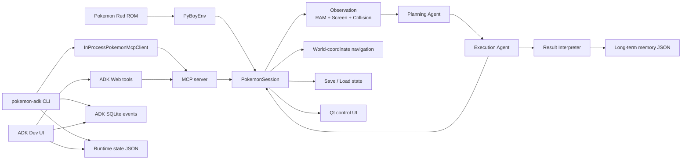
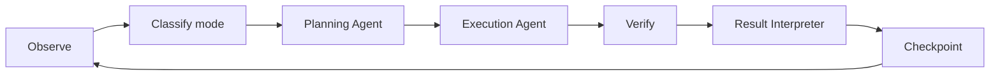

# Pokemon Red Agent 프로젝트 구조 분석 리포트 (초기 기준선)

> 작성일: 2026-08-14  
> 분석 대상: 현재 작업 트리의 Python 소스, 설정, 테스트, 실행 스크립트  
> 핵심 런타임: PyBoy + Qt(PySide6) + MCP Python SDK + Google ADK

> **현재 ADK 구조 안내:** 이 보고서의 Task 기반 ADK 설명은 과거 구조다. 현재 런타임은 Planner가
> 직접 `action + repeat_until + max_repeats`를 반환하고 Python이 반복과 RAM 검증을 담당한다.
> 최신 계약은 [`docs/architecture.md`](docs/architecture.md)를 기준으로 하며, 이 문서는 초기 기준선으로 보존한다.

## 1. 요약

이 프로젝트는 Pokemon Red ROM을 PyBoy로 실행하고, 게임 화면과 RAM을 관찰한 뒤 Google ADK 기반 에이전트가 버튼 또는 월드 좌표 이동 명령을 내리는 로컬 자동 플레이 시스템이다. 현재 LangGraph는 사용하지 않으며, 에이전트는 **Planning -> Execution -> Result Interpretation**의 세 역할로 분리되어 있다.

핵심 설계는 다음과 같다.

- `PyBoyEnv`가 에뮬레이터 API를 얇게 감싼다.
- `PokemonSession`이 관찰, 입력, 이동, 실시간 tick, 세이브 스테이트, Qt UI를 통합 관리한다.
- `mcp_server.py`가 `PokemonSession` 기능을 MCP 도구와 리소스로 노출한다.
- ADK CLI는 현재 별도 MCP 프로세스에 접속하지 않고 MCP 서버 함수를 같은 프로세스에서 직접 호출한다.
- ADK 에이전트는 계획, 실행, 결과 해석으로 역할을 나누며, 파일 장기기억과 SQLite 대화 이벤트를 사용한다.
- 게임 화면 좌표의 2x2 타일 변환은 세션 내부에 숨기고, 에이전트에는 현재 맵의 월드 좌표만 노출한다.

기능 범위는 넓고 테스트도 잘 갖춰져 있지만, 수동 실행 경로와 ADK/MCP 실행 경로에 일부 중복이 있으며 **CLI와 ADK Dev UI가 동일한 살아 있는 PyBoy 인스턴스를 공유하지 않는 것**이 가장 중요한 현재 제약이다.

## 2. 전체 구조



## 3. 실행 방식

| 목적 | 진입점 | 특징 |
|---|---|---|
| 고정 ROM 수동 플레이 | `python run_pokemon_play.py` | Qt 게임/제어 창, 키보드 입력, 저장/불러오기, 이동 및 버튼 배열 입력 |
| 패키지 수동 실행 | `pokemon-play` | `pokemon_agent.cli.manual_play:main` 진입점 |
| MCP 서버 | `pokemon-mcp` 또는 `python -m pokemon_agent.mcp_server` | stdio 기본, SSE와 streamable HTTP 지원 |
| ADK 자동 플레이 | `pokemon-adk` | 3단계 에이전트 루프, vision, 실시간 tick, 제어 UI 지원 |
| ADK Dev UI | `run_adk_web.ps1` | 에이전트 이벤트, 현재 runtime 상태, 최근 행동/대화 확인 |
| 직접 수동 실행기 | `pokemon-agent` | `app.py`의 독립적인 PyBoy 실행 루프와 UI 입력 큐 사용 |

`pyproject.toml`에 등록된 콘솔 스크립트는 다음 네 개다.

```text
pokemon-play = pokemon_agent.cli.manual_play:main
pokemon-agent = pokemon_agent.app:main
pokemon-adk = pokemon_agent.adk_agent.runner:main
pokemon-mcp = pokemon_agent.mcp_server:main
```

## 4. 디렉터리 구조

```text
New project 2/
├─ src/
│  ├─ pokered.gb                    # 고정 ROM, Git 제외
│  └─ pokemon_agent/
│     ├─ adk_agent/                 # Google ADK 에이전트 팀과 실행 루프
│     ├─ emulator/                  # PyBoy 어댑터
│     ├─ memory/                    # RAM 해석, 월드 상태, 장기기억
│     ├─ tools/                     # 경로 탐색과 좌표 변환
│     ├─ ui/                        # PySide6 제어 패널
│     ├─ vision/                    # 캡처와 collision 오버레이
│     ├─ app.py                     # 직접 수동 실행 루프와 UI 입력 큐
│     ├─ cli/
│     │  └─ manual_play.py          # 고정 ROM 수동 플레이 진입점
│     ├─ mcp_server.py              # MCP 도구/리소스 서버
│     ├─ mcp_logging.py             # MCP 호출 로그
│     └─ session.py                 # 통합 게임 세션
├─ tests/                           # 단위/통합 성격 테스트
├─ data/
│  ├─ example_map.json
│  ├─ long_term_memory.json         # 파일 장기기억
│  ├─ adk_sessions.db               # ADK 이벤트, Git 제외
│  └─ adk_runtime_state.json         # 현재 실행 상태, Git 제외
├─ states/                          # fixed_start/last/snapshot, Git 제외
├─ captures/                        # 날짜별 스크린샷/영상, Git 제외
├─ logs/actions/YYYYMMDD/           # 날짜별 행동 JSONL, Git 제외
├─ docs/architecture.md             # 초기 아키텍처 문서
├─ prompts/planner.md               # 초기 planner 프롬프트 문서
├─ pyproject.toml                   # 패키지/의존성/CLI 설정
├─ run_pokemon_play.py              # 수동 실행 래퍼
├─ run_adk_web.ps1                  # ADK Dev UI 실행 스크립트
└─ uv.lock                          # 잠금 파일
```

## 5. 핵심 모듈

### 5.1 에뮬레이터와 세션

| 모듈 | 책임 |
|---|---|
| `emulator/pyboy_env.py` | PyBoy 생성, memory 접근, 버튼, tick, 화면, tilemap, game area/collision, save/load/stop 제공 |
| `session.py` | 활성 게임 세션의 중심. 관찰, 실시간 tick, UI, 명령 큐, 상태 저장, 경로 이동을 통합 |
| `cli/manual_play.py` | 고정 ROM과 기본 state를 이용한 수동 플레이 CLI 구성 |
| `app.py` | 별도의 수동 실행 루프와 UI 입력 큐 |

고정 경로 정책은 다음과 같다.

- ROM: `src/pokered.gb`
- 시작 상태: `states/fixed_start.state`
- 최근 상태: `states/last.state`
- 추가 스냅샷: `states/` 아래 저장

`PokemonSession.observe()`는 단순한 스크린샷 함수가 아니다. 한 번의 관찰로 다음 정보를 묶어 반환한다.

- RAM에서 해석한 구조화 게임 상태
- 직전 관찰과 비교한 `state_events`
- 감시 RAM 값과 사람이 읽기 쉬운 RAM map
- 20x18 `game_area`, `game_area_collision`
- 이동 단위 기준 10x9 `walk_area_collision`
- 현재 화면에 보이는 월드 좌표와 이동 가능한 이웃 좌표
- 원본 화면 PNG base64, 160x144
- 좌표와 collision을 표시한 overlay PNG base64
- 동적 월드맵 요약
- 현재 frame과 tool 호출 인덱스

### 5.2 이동과 좌표

에이전트가 사용하는 행동 계약은 두 종류로 제한되어 있다.

```json
{"type":"buttons","buttons":["a","wait"]}
{"type":"move","target":[9,3]}
```

- `buttons`: `a`, `b`, 방향키, `start`, `select`, `wait`를 순서대로 실행한다.
- `move`: 현재 맵의 월드 좌표 `(x, y)`를 목표로 한다.
- 화면의 20x18 타일과 실제 10x9 이동 셀 사이 변환은 에이전트에 노출하지 않는다.
- 세션은 월드 좌표를 화면 walk cell로 변환한 뒤 collision 기반 Dijkstra 경로를 계산한다.
- 이동 도중 매 칸 관찰을 갱신하고 dialog, battle, menu 전환 시 중단한다.
- 방향 입력 사이에 프레임 간격을 두어 게임이 입력을 놓치지 않게 한다.
- 목표가 현재 보이는 영역 밖이면 nearest 정책에 따라 보정하거나 명시적인 실패 결과를 반환한다.

관련 모듈은 다음과 같다.

| 모듈 | 책임 |
|---|---|
| `tools/pathfinding.py` | A*, Dijkstra, 도달 가능 영역, 방향열 계산 |
| `tools/screen_navigation.py` | 20x18/10x9 변환, 화면 좌표와 월드 좌표 변환 |
| `vision/overlay.py` | 이동 가능 영역, 월드 좌표, 플레이어 위치 overlay 생성 |

### 5.3 MCP 계층

`mcp_server.py`는 모듈 전역의 `PokemonSession` 하나를 소유하고 다음 도구를 노출한다.

- 세션 시작/종료
- `observe`
- 버튼 배열 입력과 `wait`
- save/load/reset
- walk cell 이동과 world cell 이동
- 최근 MCP 명령 조회
- 실시간 tick 시작/중지/상태 조회

주요 MCP 리소스는 다음과 같다.

```text
pokemon://state/latest
pokemon://ram/latest
pokemon://game-area/latest
pokemon://collision/latest
pokemon://mcp-log/recent
pokemon://realtime/status
```

기본 transport는 stdio이며 SSE와 streamable HTTP도 선택할 수 있다. stdio 실행 시 서버 루프와 함께 Qt UI 갱신 및 비동기 realtime tick pump가 동작한다.

중요하게도 `adk_agent/client.py`의 `InProcessPokemonMcpClient`는 실제 stdio MCP 서버에 접속하지 않는다. 동일 Python 프로세스 안에서 `mcp_server.py`의 함수를 직접 호출한다. MCP 도구 계약은 재사용하지만 프로세스 격리나 원격 세션 공유는 하지 않는 구조다.

### 5.4 Google ADK 에이전트 팀 (리팩터링 전 기준선)

ADK 자동 플레이는 다음 순서로 한 step을 수행한다.



자동 state rollback을 수행하던 recover 단계는 제거되었다. `stuck_score`는 진단용으로 남지만 세션을 과거 state로 되돌리지 않는다.

| 구성요소 | 책임 |
|---|---|
| `adk_agent/runner.py` | CLI 옵션, session/client/agent 조립, 기본 실행값 |
| `adk_agent/agents/planner/` | Gemini planner, planner prompt, action/state contract |
| `adk_agent/agents/executor/` | deterministic MCP executor와 execution contract |
| `adk_agent/agents/interpreter/` | 결과 해석, interpreter prompt, memory contract |
| `adk_agent/coordinator/loop.py` | observe부터 checkpoint까지 coordinator loop |
| `adk_agent/coordinator/action_cycle.py` | deterministic StateDiff와 action/Goal verifier |
| `adk_agent/runtime/` | SQLite context, runtime state, history, logging, trace |
| `adk_agent/web/app.py` | ADK Dev UI root/sub-agent 정의 |
| `adk_agent/web/tools.py` | Dev UI용 관찰/조작/상태/메모리 도구 |
| `adk_agent/client.py` | MCP client protocol과 in-process adapter |
| `adk_agent/runner.py` | CLI 옵션과 team 조립 |

세 역할의 경계는 다음과 같다.

1. **Planning Agent**는 최신 관찰, 화면과 overlay, 관련 장기기억을 읽고 다음 `buttons` 또는 `move` 행동을 결정한다. 직접 PyBoy를 조작하지 않는다.
2. **Execution Agent**는 계획을 검증하고 허용된 행동만 MCP 계층으로 전달한다. 도구 예외도 report로 변환해 전체 루프가 바로 종료되지 않도록 한다.
3. **Result Interpreter**는 실행 전후 차이와 history를 해석한다. raw history가 20개를 넘을 때 오래된 구간을 요약하고 최근 20개는 유지한다.

### 5.5 컨텍스트와 장기기억 (리팩터링 전 기준선)

모델 호출의 크기를 통제하기 위해 저장 데이터와 모델에 실제 전달하는 데이터가 분리되어 있다.

| 데이터 | 유지 정책 | 용도 |
|---|---|---|
| ADK SQLite 이벤트 | 전체 보존 | Dev UI 추적과 대화 기록 |
| planner 모델 세션 | 최근 5턴 | 다음 행동 결정을 위한 짧은 대화 맥락 |
| 이전 이미지 | 모델 context에서 제거 | 매 호출마다 누적되는 vision token 방지 |
| 최신 screenshot/overlay | 현재 planner 호출에만 첨부 | 현재 화면 판단 |
| `action_history` | raw 최근 20개 | 실행 결과 판단 및 압축 대상 |
| Result Interpreter 이전 세션 | 유지하지 않음 | 매 요약 호출을 stateless하게 처리 |

파일 장기기억은 `memory/file_memory.py`가 `data/long_term_memory.json`에 원자적으로 저장한다. Planner는 `search_memory(map_name)` 도구로 현재 맵의 항목만 읽고, Interpreter는 `save_memory(map_name, value)` 도구로 저장한다. 키는 항상 `map:<map_name>`이다.

`memory/`의 주요 구성은 다음과 같다.

| 모듈 | 책임 |
|---|---|
| `memory_reader.py` | Gen 1 RAM 주소를 플레이어, 파티, 아이템, 전투, 메뉴, dialog, warp 등으로 해석 |
| `world_state.py` | RAM 결과를 구조화된 `GameState`로 변환 |
| `ram_map.py` | Qt UI에서 볼 수 있는 RAM map 텍스트 생성 |
| `world_map.py` | 맵별 방문 위치, frontier, collision을 동적으로 누적 |
| `file_memory.py` | 맵 단위 JSON 장기기억 읽기와 원자적 쓰기 |

### 5.6 Qt UI와 캡처

`ui/control_panel.py`는 게임 화면과 collision overlay를 두 창으로 표시한다. 제어 창에서는 다음 정보를 탭으로 확인한다.

- RAM Map
- Game Area
- Collision
- World Map
- MCP Log

UI에서 fixed/snapshot 저장, fixed state 불러오기, 종료, 월드 좌표 이동, nearest 옵션, 최대 이동 step, 버튼 배열 전송을 수행할 수 있다. RAM 텍스트가 갱신되어도 사용자의 스크롤 위치를 유지한다.

`vision/capture.py`는 PNG, GIF, MP4 저장을 담당하고, 캡처 결과는 날짜별 폴더에 저장한다. `vision/overlay.py`는 현재 월드 좌표와 collision을 게임 화면에 그린다.

## 6. LLM 호출이 발생하는 모든 지점 (현재 구현)

애플리케이션 코드가 Gemini SDK의 `generate_content()`를 직접 호출하는 곳은 없다. 명시적인 네트워크 진입점은 Google ADK `Runner.run_async()` 두 곳이며, ADK Dev UI에서는 ADK Web runtime이 세 model agent를 대신 실행한다. `Agent(...)`, `Runner(...)`, `GenerateContentConfig(...)` 생성과 screenshot 직렬화는 설정/입력 준비일 뿐 LLM 요청이 아니다.

### 6.1 자동 플레이 CLI planner

```text
pokemon-adk
  -> runner.py:153-159 GoogleAdkPlanner 생성
  -> coordinator/loop.py:111 action_cycle_needs_planning(state)
  -> coordinator/loop.py:138 PlanningAgent.plan()
  -> agents/planner/agent.py:57 action_planner.plan(...)
  -> agents/planner/agent.py:258 asyncio.run(plan_async(...))
  -> agents/planner/agent.py:275 self.runner.run_async(...)  # 실제 LLM 네트워크 진입점
```

| 항목 | 현재 동작 |
|---|---|
| model agent | `pokemon_red_planner` |
| 직접 호출문 | `src/pokemon_agent/adk_agent/agents/planner/agent.py:275` |
| 활성화 조건 | `--adk-model` 값이 있을 때. 기본값은 `gemini-3.5-flash`; `--no-adk-model`이면 생성하지 않음 |
| 호출 조건 | 현재 Task가 없거나, Task가 terminal 상태이거나, `replan_required=true`일 때 |
| 호출하지 않는 경우 | 진행 중인 Task가 있으면 action마다 다시 부르지 않음 |
| 입력 | Goal, Task/TaskResult, compact GameState, 최근 transition, 관련 장기기억, story dependency |
| vision | `--adk-vision`이면 현재 호출의 최신 screenshot과 overlay만 첨부 |
| 출력 | 직접 버튼이 아닌 bounded `TaskDecision` JSON |
| 실패 시 | Python deterministic fallback Task를 사용하며 게임 루프는 계속 진행 |

Planner 세션은 요청 직전에 최근 turn 수를 제한하고 과거 media part를 제거한다. 따라서 대화 context는 유지하지만 이전 screenshot들이 호출마다 누적되지는 않는다.

### 6.2 자동 플레이 CLI result interpreter

```text
PokemonAdkLoop.run()
  -> coordinator/loop.py:244 _interpret(state)
  -> agents/interpreter/agent.py:80 ResultInterpreterAgent.interpret()
  -> tasking.py:471 should_interpret_task_result(...)
  -> agents/interpreter/agent.py summarizer.summarize(payload)
  -> agents/interpreter/agent.py:518 asyncio.run(summarize_async(...))
  -> agents/interpreter/agent.py:545 self.runner.run_async(...)  # 실제 LLM 네트워크 진입점
```

| 항목 | 현재 동작 |
|---|---|
| model agent | `pokemon_red_result_interpreter_agent` |
| 직접 호출문 | `src/pokemon_agent/adk_agent/agents/interpreter/agent.py:545` |
| 활성화 조건 | `--adk-model` 값이 있어 interpreter 객체가 생성된 경우 |
| 호출 조건 | Task 결과가 `completed`, `failed`, `blocked`, `unexpected`이거나 `important_event=true`일 때 |
| 호출하지 않는 경우 | `task_result=continue`이고 중요한 durable event가 없을 때 |
| 입력 | Goal, Task, deterministic TaskResult/StateDiff, compact execution result, 최근 transition 5개, 장기기억 |
| 이미지 | 첨부하지 않음 |
| 이전 대화 context | 0턴; 각 결과 해석 요청은 stateless |
| 출력 | 결과 요약과 검증 가능한 장기기억 후보 |
| 실패 시 | deterministic 결과는 유지되고 게임도 계속 진행 |

`coordinator/loop.py`의 `_interpret()` 자체는 action마다 실행되지만, 대부분의 action에서는 `agents/interpreter/agent.py`가 `llm_called=false`인 Python no-op 결과를 반환한다. history가 20턴을 넘었다는 이유만으로 interpreter LLM을 호출하지 않는다.

### 6.3 ADK Dev UI root agent

`src/pokemon_agent/adk_agent/web/app.py`는 `pokemon_red_team`을 `Agent(model=selected_model)`로 등록한다. 사용자가 Dev UI에서 이 agent에 메시지를 보내면 명시적인 `Runner.run_async()`가 프로젝트 코드에 보이지 않아도 ADK Web runtime 내부에서 LLM 요청이 발생한다.

Root agent는 다음 판단에 모델을 사용한다.

- 상태/로그 조회 도구 선택
- `run_team_step` 또는 `run_rule_based_step` 선택
- realtime tick 설정
- planning/result interpreter sub-agent 위임
- 도구 결과를 읽은 뒤 최종 응답 생성

도구를 쓰는 메시지는 보통 도구 선택 전 한 번, 도구 결과를 받은 뒤 한 번 이상 모델 왕복이 생긴다. 여러 도구 또는 sub-agent 위임이 이어지면 한 사용자 메시지에서도 호출 수가 증가한다. `AFC is enabled with max remote calls: 10`은 자동 function calling 한 요청에서 허용되는 원격 왕복의 상한이지, 매 실행마다 정확히 10회를 호출한다는 뜻은 아니다.

### 6.4 ADK Dev UI sub-agent

`build_root_agent()`가 만드는 model sub-agent는 현재 두 개다.

| Dev UI agent | 정의 위치 | LLM 호출 시점 | 도구 |
|---|---|---|---|
| `pokemon_red_planning_agent` | `agent.py:53-69` | 직접 메시지를 보내거나 root가 planning agent로 위임할 때 | start/observe/screenshot, `search_memory`, log read |
| `pokemon_red_result_interpreter_agent` | `agent.py:70-83` | 직접 메시지를 보내거나 root가 결과 해석 agent로 위임할 때 | observe, `search_memory`, `save_memory`, log read |

Dev UI execution sub-agent는 제거되었다. 실제 action 실행은 Python `ExecutionAgent`와 MCP 도구가 담당하며 별도 execution LLM 호출은 없다.

### 6.5 Dev UI 도구 내부의 중첩 호출

`web/tools.py`의 `run_rule_based_step()`은 `PokemonAdkLoop(client)`를 planner와 summarizer 없이 생성한다. `run_team_step()`도 이 함수를 호출한다. 따라서 이 도구 내부에서는 Gemini planner/interpreter를 다시 호출하지 않는다.

```text
Dev UI 사용자 메시지
  -> ADK runtime의 root LLM 호출
  -> run_team_step tool
       -> Python Task 선택/실행/관찰/검증
       -> LLM planner/interpreter 없음
  -> ADK runtime의 root LLM이 tool 결과를 읽고 응답
```

### 6.6 LLM을 호출하지 않는 경로

- `python run_pokemon_play.py`
- `pokemon-agent`
- `python -m pokemon_agent.mcp_server`
- `pokemon-adk --no-adk-model`
- `observe`, RAM parsing, screenshot/overlay 생성
- `buttons`, `move`, Dijkstra navigation
- Task action 선택과 deterministic Task/Goal verification
- save/load/checkpoint, realtime tick, MCP/action logging
- JSON 장기기억 검색/쓰기와 deterministic history 압축
- Dev UI 도구 내부의 `run_rule_based_step()`/`run_team_step()`

### 6.7 전체 호출 포인터 요약

| 구분 | 모델 요청을 시작하는 지점 | 직접/암시적 |
|---|---|---|
| CLI action planner | `agents/planner/agent.py:275` `self.runner.run_async(...)` | 직접 |
| CLI result interpreter | `agents/interpreter/agent.py:545` `self.runner.run_async(...)` | 직접 |
| Dev UI root | `agent.py:84-106`에서 등록된 `pokemon_red_team`을 ADK Web runtime이 실행 | 암시적 |
| Dev UI planning sub-agent | `agent.py:53-69`에서 등록, 직접 대화/위임 시 runtime이 실행 | 암시적 |
| Dev UI result interpreter sub-agent | `agent.py:70-83`에서 등록, 직접 대화/위임 시 runtime이 실행 | 암시적 |

이 밖의 action-planning 호환 adapter는 제거되었다. 따라서 애플리케이션 소스에서 직접 LLM 요청을 시작하는 문장은 위 CLI `Runner.run_async()` 두 곳뿐이다. Dev UI의 세 model agent는 ADK Web runtime이 실행하므로 프로젝트 코드에 별도 요청문이 나타나지 않는다.

## 7. RAM에서 관리하는 상태

RAM reader는 다음 종류의 상태를 지속적으로 갱신한다.

- 현재 map id/name, 이전 map, map 크기, tileset
- 플레이어 월드 X/Y, 방향, 이동 및 메뉴 상태
- battle type, battle 활성 여부, 상대 및 전투 관련 값
- dialog 활성 여부와 가능한 dialog text
- 플레이어/라이벌 이름, trainer id
- 돈, 코인, badge, play time
- 파티 Pokemon의 종, 레벨, HP, 상태, 기술 등
- 아이템과 수량
- Pokedex owned/seen
- warp와 출구, 주변 NPC
- 진행 flags와 원시 RAM watch 값

관찰 사이의 변화를 비교해 dialog open/close, battle start/end, map change, position change 같은 `state_events`도 만든다. 따라서 planner는 화면만 보는 것이 아니라 RAM 기반 상태 전환을 함께 판단할 수 있다.

## 8. 프로세스 및 상태 공유 경계

현재 구조에서 가장 혼동하기 쉬운 부분이다.

- 한 Python 프로세스 안에서는 `mcp_server.py`의 전역 `PokemonSession`을 여러 도구가 공유한다.
- `pokemon-adk`는 in-process client를 사용하므로 해당 CLI 프로세스의 세션을 조작한다.
- `adk web`은 별도 Python 프로세스이므로 자체 `PokemonSession`과 자체 PyBoy 인스턴스를 만든다.
- CLI와 Dev UI는 `data/adk_sessions.db`와 `data/adk_runtime_state.json`을 통해 이벤트와 실행 상태를 공유한다.
- 그러나 두 프로세스가 살아 있는 동일 에뮬레이터 객체를 공유하지는 않는다.

따라서 Dev UI는 CLI가 무엇을 요청하고 실행했는지 관찰할 수 있지만, Dev UI의 직접 버튼/이동 도구가 이미 실행 중인 CLI 게임 인스턴스를 조작하는 구조는 아니다. 이를 통합하려면 PyBoy 세션을 단일 MCP 서비스 프로세스가 소유하게 하고 CLI와 Dev UI가 모두 실제 transport를 통해 그 서비스에 접속해야 한다.

## 9. 실행 경로의 책임

초기 규칙 기반 `agent/` 패키지와 `TaskManager`는 제거되었다.

- `app.py`: 사람의 키보드 및 Qt 제어판 입력을 받는 수동 PyBoy 실행 경로
- `adk_agent/`, `session.py`, `mcp_server.py`: Google ADK와 MCP 자동 플레이 경로

`app.py`는 자동 행동을 결정하지 않는다. 자동 플레이의 계획, 실행, 검증은 `adk_agent/`와 `PokemonSession`에만 존재한다.

또한 다음 문서는 현재 코드보다 오래된 가정을 포함한다.

- `docs/architecture.md`: vision을 사용하지 않는다는 설명과 recover 흐름이 현재 코드와 다르다.
- `prompts/planner.md`: 현재의 `buttons`/`move` 전용 계약보다 이전 행동 모델을 설명한다.
- 역할별 prompt는 `agents/planner/prompt.py`, `agents/interpreter/prompt.py`, `web/prompt.py`가 각각 소유한다.

## 10. 테스트 구조

`tests/`에는 18개 테스트 파일이 있으며 다음 영역을 다룬다.

초기 분석 시 전체 테스트는 **83 passed, 4 warnings**였다. Task 리팩터링과 실제 ROM 경로 보정 완료 후 현재 결과는 **109 passed, 4 warnings**이며 자세한 검증 항목은 `ADK_TASK_REFACTOR_REPORT.md`에 기록했다. 경고 4건은 Google ADK의 `BaseAgentConfig`가 향후 제거될 예정이라는 deprecation warning이다.

- RAM 주소 해석과 구조화 상태
- `observe()`의 screenshot/overlay/collision schema
- Dijkstra와 좌표 변환, world 이동
- dialog/battle/menu 중단 조건
- realtime tick과 command queue
- save/load와 fixed state
- MCP 도구 및 로그
- ADK planner, 3단계 loop, context trimming, Dev UI tool
- 파일 장기기억과 history 압축
- Qt UI queue와 스크롤 유지
- PNG/GIF/MP4 캡처

테스트는 fake PyBoy를 적극 사용한다. 빠른 회귀 검증에는 적합하지만 다음은 자동화 범위 밖에 가깝다.

- 실제 Pokemon Red ROM을 끝까지 진행하는 통합 테스트
- 실제 Gemini API 응답과 quota/backoff 검증
- 별도 프로세스 간 실제 MCP transport 통합 테스트
- Qt 두 창의 픽셀 단위 시각 회귀 테스트

## 11. 현재 구조의 장점

1. **관찰 데이터가 풍부하다.** screenshot, overlay, RAM, collision, world map, state event가 한 관찰에 결합된다.
2. **에이전트 행동 표면이 작다.** LLM이 임의 저수준 API를 호출하지 않고 `buttons`와 `move` 두 계약만 사용한다.
3. **좌표 복잡도를 감췄다.** planner는 월드 좌표만 다루고 2x2 타일 보정은 navigation 계층이 담당한다.
4. **실패가 추적 가능하다.** MCP 로그, 날짜별 action JSONL, terminal trace, SQLite 이벤트, runtime JSON이 함께 존재한다.
5. **컨텍스트 비용을 제한한다.** 최신 이미지만 모델에 전달하고 planner 대화와 raw history의 상한을 둔다.
6. **수동 개입 경로가 좋다.** Qt에서 화면, collision, RAM, 명령 로그를 보며 저장과 이동을 직접 수행할 수 있다.

## 12. 위험과 기술 부채

### 우선순위 높음

- **에뮬레이터 소유권 분리:** ADK CLI와 Dev UI가 같은 live session을 공유하지 않는다.
- **중복 실행 루프:** `app.py`와 `PokemonSession`이 입력, UI, tick 책임을 나눠 갖고 있어 동작 차이가 생길 수 있다.
- **실제 ROM 회귀 검증 부족:** fake environment 테스트가 통과해도 게임 고유 timing과 RAM 조건은 달라질 수 있다.
- Planning, Execution, Result Interpretation 구현은 역할별 패키지로 분리되어 있다.

### 우선순위 중간

- ADK Dev UI 진입점은 `adk_agent/web/app.py`, 패키지 로더 진입점은 `adk_agent/__init__.py`이다.
- 오래된 `docs/architecture.md`, `prompts/planner.md`를 현재 ADK 구조로 갱신해야 한다.
- Gemini 429에 대비한 명시적 요청 pacing, RetryInfo 기반 backoff, 호출별 token 측정이 필요하다.

## 13. 권장 개선 순서

1. **단일 세션 서비스화:** 한 MCP 서버만 PyBoy를 소유하고 ADK CLI, Dev UI, 수동 UI가 같은 transport endpoint를 사용하게 한다.
2. **실행 경로 통합:** `app.py`의 직접 PyBoy 조작을 `PokemonSession` 위로 옮겨 관찰과 버튼 timing을 한 곳에서 관리한다.
3. **문서와 prompt 정리:** 현재 행동 계약, no-recover 정책, vision 입력, context 상한을 공식 문서에 반영한다.
4. **실제 ROM smoke test:** 고정 state에서 observe -> buttons -> move -> save/load를 검사하는 재현 가능한 수동 또는 opt-in 테스트를 만든다.
5. **비용 제어 강화:** planner 호출 간격, 429 재시도, 동일 화면에서 불필요한 재계획 억제를 추가한다.

## 14. 주요 실행 명령

```powershell
# 고정 ROM 수동 플레이와 Qt UI
.\.venv\Scripts\python.exe run_pokemon_play.py

# MCP 서버 + 실시간 tick + Qt UI
.\.venv\Scripts\python.exe -m pokemon_agent.mcp_server `
  --realtime-ticks --realtime-fps 60 --ui-refresh-hz 30

# ADK 자동 플레이 기본 실행
.\.venv\Scripts\pokemon-adk.exe

# ADK Dev UI
.\run_adk_web.ps1

# 테스트
.\.venv\Scripts\python.exe -m pytest
```

## 15. 결론

현재 프로젝트는 단순한 PyBoy 자동 입력 스크립트가 아니라, RAM 기반 상태 추출, vision 관찰, collision-aware 이동, MCP 도구화, Google ADK 다중 역할 에이전트, 파일 장기기억, Qt 관제 UI를 갖춘 실험 플랫폼에 가깝다.

다음 구조적 전환점은 기능을 더 추가하는 것보다 **PyBoy 세션 소유자를 하나로 통일하는 것**이다. 이 작업이 완료되면 CLI, Dev UI, 수동 UI가 같은 게임 상태를 보고 조작할 수 있고, 현재 남아 있는 중복 실행 경로와 상태 불일치 문제도 크게 줄일 수 있다.
